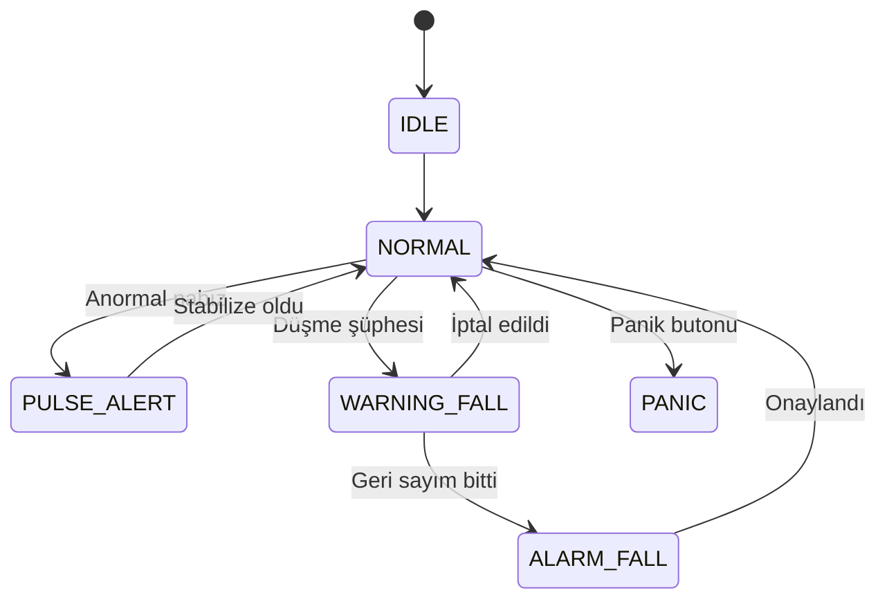

<div align="center">

# 🩺 ÇTDP

### Akıllı Giyilebilir Sağlık Takip Uygulaması

[](https://kotlinlang.org)
[](https://developer.android.com/jetpack/compose)
[](https://developer.android.com)

[]()
[]()
[]()

</div>

---

ÇTDP, Bluetooth üzerinden bağlanılan bir giyilebilir sensörden alınan **nabız (BPM)** ve **oksijen (SpO2)** verilerini takip eden, **düşme algılama** ve **acil durum (panik) bildirimi** sağlayan bir Android uygulamasıdır.

## ✨ Özellikler

| Özellik | Açıklama |
|---|---|
| ❤️ **Nabız & SpO2 Takibi** | Sensörden gelen anlık nabız ve oksijen seviyesi verilerini gösterir |
| 📊 **Sistem Durumu İzleme** | `IDLE`, `NORMAL`, `PULSE_ALERT`, `WARNING_FALL`, `ALARM_FALL`, `PANIC` durumlarını yönetir |
| 🚨 **Düşme Algılama** | Düşme şüphesinde geri sayım başlatır, süre dolarsa alarma geçer |
| 🆘 **Panik Butonu** | Acil durumda manuel olarak panik modu tetiklenebilir |
| 💬 **SMS Bildirimi** | Acil durumlarda otomatik SMS gönderir |
| 🔔 **Bildirimler** | Sistem bildirimleri ile kullanıcı uyarılır |

## 🚦 Sistem Durumları



## 🛠️ Teknolojiler

- **Kotlin**
- **Jetpack Compose** (Material 3)
- **Android ViewModel & StateFlow**
- **Bluetooth** (Classic/BLE) izinleri

## 📁 Proje Yapısı

```
app/src/main/java/com/erdem/tdp/
├── MainActivity.kt
├── data/
│   └── HeartRateViewModel.kt   # Nabız, SpO2 ve sistem durumu yönetimi
├── design/
│   ├── DashboardScreen.kt      # Ana ekran
│   ├── SettingsScreen.kt       # Ayarlar ekranı
│   ├── StatusCard.kt           # Durum kartı bileşeni
│   └── UserPreferences.kt      # Kullanıcı tercihleri
└── ui/theme/                   # Compose tema dosyaları
```

## ⚙️ Gereksinimler

- Android Studio
- minSdk 24, targetSdk/compileSdk 36

## 🔐 İzinler

| İzin | Amaç |
|---|---|
| `BLUETOOTH`, `BLUETOOTH_ADMIN`, `BLUETOOTH_CONNECT`, `BLUETOOTH_SCAN` | Sensör ile kablosuz iletişim |
| `POST_NOTIFICATIONS` | Durum bildirimleri |
| `SEND_SMS` | Acil durum SMS gönderimi |

## 🚀 Kurulum ve Çalıştırma

1. Projeyi Android Studio ile açın.
2. Gradle senkronizasyonunun tamamlanmasını bekleyin.
3. Bir cihaz veya emülatörde `app` modülünü çalıştırın.

```bash
./gradlew assembleDebug
```

---

<div align="center">
Made with ❤️ using Jetpack Compose
</div>
